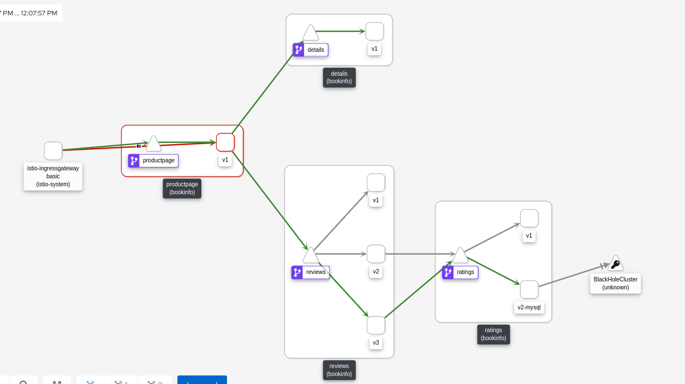

# bookinfo-extddbb
Service Mesh configuration for bookinfo sample application with external ratings database using an egress Gateway for routing TCP traffic - [Egress TCP blog post](https://istio.io/latest/blog/2018/egress-tcp/).

In this example, the components used are as follows:
 - [Openshift Container Platform 4.8](https://docs.openshift.com/ "Openshift's Documentation")
 - [Maistra Service Mesh 2.0.6](https://maistra.io/ "Maistra's Documentation") -- [Istio v1.6](https://istio.io/v1.6/ "Istio's Documentation")
 - [Bookinfo Sample application](https://github.com/maistra/istio/tree/maistra-2.1/samples/bookinfo "Bookinfo Sample")
 - [Mysql 8.0](https://dev.mysql.com/doc/relnotes/mysql/8.0/en/)


## Prerequisites
 - OCP up and running.
 - DNS zone (external hosted zone in this example). Thus, I can use an alias instead of the external service name. The idea is to abstract the applications from the external service's name using the **Service Entry** object.
 - Openshift Service Mesh installed [Openshift Service Mesh](https://docs.openshift.com/container-platform/4.8/service_mesh/v2x/ossm-about.html).
 - Egress configured in SMCP [Egress config](ossm-config/basic.yaml).


## MySQL instances
Three MySQL instances are deployed outside the Mesh in the _ddbb_ project: mysql-1, mysql-2 and mysql-3. Each mysql instance has a different rating number that will be consumed by the ratings application:
* mysql-1: Ratings point equals 1.
* mysql-2: Ratings point equals 5.
* mysql-3: Ratings point equals 3.

Create ddbb project
```
oc new-project ddbb
```

Create secret with MySQL credentials used by buildconfig
```
oc create -n ddbb secret generic mysql-credentials-1 --from-env-file=./mysql-deploy/params.env
oc create -n ddbb secret generic mysql-credentials-2 --from-env-file=./mysql-deploy/params-2.env
oc create -n ddbb secret generic mysql-credentials-3 --from-env-file=./mysql-deploy/params-3.env
```

Deploy mysql-1
```Shell
oc process -f mysql-deploy/mysql-template.yaml --param-file=mysql-deploy/params.env | oc create -n ddbb -f -
```

Deploy mysql-2
```Shell
oc process -f mysql-deploy/mysql-template.yaml --param-file=mysql-deploy/params-2.env | oc create -n ddbb -f -
```

Deploy mysql-3
```Shell
oc process -f mysql-deploy/mysql-template.yaml --param-file=mysql-deploy/params-3.env | oc create -n ddbb -f -
```

All the MySQL instances should be running in _ddbb_ project.

## Egress TCP using Service Entry. TCP routing from sidecar to egress and from egress to external service.
### Explanation
Ratings application consumes external MySQL databases ([Ratings config here](./bookinfo/bookinfo-ratings-v2-mysql.yaml)). This application will connect to _mysql.external_ host, which will be resolved by the Service Entry object. Then, the Service Entry object will route the traffic to two different external databases with different weight 80/20 (the application does not know that it is connecting to two different databases). Also, the ratings-custom application consumes a MySQL database too ([Ratings-custom config here](./bookinfo/custom/bookinfo-ratings-v2-mysql_custom.yaml)).

### App diagram
The traffic flow is:
1. The sidecar intercept the request from the app container (ratings) to _mysql.external_.
2. The Virtual Service and Destination Rule objects route the request from the sidecar (bookinfo) to the egress Gateway (istio-system).
3. At this point, the Virtual Service and Service Entry objects resolve the endpoints and route the traffic through the egress Gateway.


### Deploy Bookinfo application
It is time to deploy the bookinfo sample application. In this use case, only one bookinfo application is deployed in bookinfo project.

Create bookinfo project
```
oc new-project bookinfo
```
Add bookinfo project to Service Mesh
```
oc create -n bookinfo -f bookinfo/smm.yaml
```

Deploy bookinfo application
```
oc apply -n bookinfo -f bookinfo/bookinfo.yaml
```

#### Exposing the bookinfo application
Get the default ingress domain and replace the $EXTERNAL_DOMAIN variable in _bookinfo/ossm/certs.sh_ and _bookinfo/ossm/certs/cert.conf_ files.

```
oc -n openshift-ingress-operator get ingresscontrollers default -o json | jq -r '.status.domain'
```

Create the certificates.
```
./ossm/certs.sh
```

Client and server certificates should be created under ossm/certs/ folder. Now, create the secret in OCP:
```
oc create secret tls ingress-credential -n istio-system --key=ossm/certs/server.key --cert=ossm/certs/server.pem
```

Replace the $EXTERNAL_DOMAIN variable in the [Gateway object](./ossm/istio-system/gw-default.yaml), [OpenShift route object](./ossm/istio-system/route-bookinfo.yaml) and [Bookinfo VS object](./ossm/bookinfo/vs-bookinfo.yaml). Create Gateway, Virtual Services, Destination Rules and OpenShift route.
```
oc apply -n istio-system -f ossm/istio-system/gw-default.yaml
oc apply -n istio-system -f ossm/istio-system/route-bookinfo.yaml
oc apply -n bookinfo -f ossm/bookinfo/vs-bookinfo.yaml
oc apply -n bookinfo -f ossm/bookinfo/dr-all-mtls.yaml
```

At this point, the bookinfo application is up and running, but ratings application is consuming the internal database instead of the MySQL deployed previously. The application is accessible from outside the cluster using the ingress gateway.
```
export GATEWAY_URL=$(oc get route bookinfo -n istio-system -o jsonpath='{.spec.host}')
curl -vI $GATEWAY_URL/productpage -I

export GATEWAY_URL=$(oc get route bookinfo-secure -n istio-system -o jsonpath='{.spec.host}')
curl -vI https://$GATEWAY_URL/productpage -I  --cacert ossm/certs/ca.pem --cert ossm/certs/client.pem --key ossm/certs/client.key
```

### Set external database as ratings database for bookinfo sample application
Deploy ratings application with MySQL configuration
```
oc process -f bookinfo/bookinfo-ratings-v2-mysql.yaml --param-file=./bookinfo/params.env | oc create -n bookinfo -f -
```
Route all the traffic destined to the _reviews_ service to its __v3__ version and route all the traffic destined to the _ratings_ service to _ratings v2-mysql_ that uses the MySQL databases previously deployed.
```
oc apply -n bookinfo -f ossm/bookinfo/virtual-service-ratings-mysql.yaml
```

At this moment, the bookinfo application is trying to retrieve the ratings info from the external DDBB. As you can see, the ratings service is currently unavailable. 

Check in Kiali that the _v2-msqyl_ service is trying to reach the mysql DDBB via BlackHoleCluster.




Now, it's time to create the Istio objects to route the traffic through an egress Gateway in order to reach the external DDBB.

Create Istio objects
```
oc apply -n bookinfo -f ossm/bookinfo/dr-default-egress.yaml
oc apply -n bookinfo -f ossm/bookinfo/vs-ratings-egress.yaml
oc apply -n bookinfo -f ossm/bookinfo/se-mysql.yaml
oc apply -n istio-system -f ossm/istio-system/gw-tcp-egress.yaml
oc apply -n istio-system -f ossm/istio-system/se-mysql-ddbb.yaml
oc apply -n istio-system -f ossm/istio-system/vs-mysql-ddbb.yaml
oc apply -n istio-system -f ossm/istio-system/dr-mysql-ddbb.yaml
```

Once created the Istio objects, ratings service should works and retrieve data from the external database. Since the traffic is splitted 80/20 between two different databases, the data retrieved should be different if you run some requests to the application.

Check in Kiali the traffic flow.


### Add an additional bookinfo application
Istio's TCP traffic capabilites are more limited than HTTP. There is a topic created in Istio for using TCP Service Entries with the same port [Istio topic](https://discuss.istio.io/t/multiple-tcp-serviceentries-with-same-port/7535) and the result is not good. Istio uses only the port to identify the routing for TCP traffic if no addresses are set. So, what happens in bookinfo project if two applications are trying to connect to port 3306 and whose destination is different external databases?

I tried to solve this issue in bookinfo project using **sourceLabels** for identify where the traffic is coming from, and it works in _bookinfo_ project, but a new problem is generated in _istio-system_ project.

Using **sourceLabels** I am able to match the traffic from the different app containers, and this traffic is routed to the Egress Gateway's K8S Service located in _istio-system_, port 443 in this use case. At this point, **I need to know where the traffic is coming from and where I want to route it, and it is impossible using TCP**. For HTTP traffic it can be done using [HTTPMatchRequest](https://istio.io/v1.6/docs/reference/config/networking/virtual-service/#HTTPMatchRequest) with any field, and for HTTPS traffic it can be done using [TLSMatchAttributes](https://istio.io/v1.6/docs/reference/config/networking/virtual-service/#TLSMatchAttributes) with sniHosts, for instance.

The problem is solved setting a different port in the Egress Gateway, one port for each external database.

In summary:
+ Two bookinfo applications deployed in _bookinfo_ project. App bookinfo will use the mysql-1 and mysql-2 external databases, and the App bookinfo-custom will use the mysql-3 external database.
+ Use sourceLabels in _bookinfo_ project [Virtual Service mysql-egress](./ossm/bookinfo-custom/vs-ratings-egress-custom.yaml).
+ Add an additional port to the Egress Gateway (https-9443 port).
+ One Service Entry object per external database.

In this use case, the traffic flow is:
1. The sidecar intercept the request from the app container (ratings or ratings-custom) to _mysql.external_ or _mysql-3.external_.
2. The Virtual Service and Destination Rule objects route the request from the sidecar (bookinfo) to the egress Gateway (istio-system).
3. At this point, the Virtual Service and Service Entry objects resolve the endpoints and route the traffic through the egress Gateway.


### Deploy Custom Bookinfo application
It is time to deploy the custom bookinfo application. Now, two bookinfo applications will be running in _bookinfo_ project.

Deploy custom bookinfo application
```
oc apply -n bookinfo -f bookinfo/custom/bookinfo-custom.yaml
```

Deploy ratings application with MySQL configuration
```
oc process -f bookinfo/custom/bookinfo-ratings-v2-mysql_custom.yaml --param-file=./bookinfo/custom/params.env | oc apply -n bookinfo -f -
```
Route all the traffic destined to the _reviews_ service to its __v3__ version and route all the traffic destined to the _ratings_ service to _ratings v2-mysql_ that uses the MySQL databases previously deployed.
```
oc apply -n bookinfo -f ossm/bookinfo-custom/virtual-service-ratings-mysql_custom.yaml
```

At this point, the bookinfo application is up and running and set with external database, but ratings application is not able to retrieve any data from _mysql-3_ instance.

Create Virtual Services, Destination Rules and OpenShift route.
```
oc apply -n istio-system -f ossm/istio-system-custom/route-bookinfo.yaml
oc apply -n bookinfo -f ossm/bookinfo-custom/vs-bookinfo.yaml
oc apply -n bookinfo -f ossm/bookinfo-custom/dr-all-mtls.yaml
```

Now, it's time to create the Istio objects to route the traffic through an egress Gateway in order to reach the _mysql-3_ external DDBB.

Create Istio objects
```
oc apply -n bookinfo -f ossm/bookinfo-custom/dr-default-egress.yaml
oc apply -n bookinfo -f ossm/bookinfo-custom/vs-ratings-egress-custom.yaml
oc apply -n bookinfo -f ossm/bookinfo-custom/se-mysql-custom.yaml
oc apply -n istio-system -f ossm/istio-system-custom/gw-tcp-egress.yaml
oc apply -n istio-system -f ossm/istio-system-custom/se-mysql-ddbb-3.yaml
oc apply -n istio-system -f ossm/istio-system-custom/vs-mysql-ddbb-3.yaml
oc apply -n istio-system -f ossm/istio-system-custom/dr-mysql-ddbb-3.yaml
```

The application is accessible from outside the cluster using the ingress gateway.
```
export GATEWAY_URL=$(oc get route bookinfo-custom -n istio-system -o jsonpath='{.spec.host}')
curl -vI $GATEWAY_URL/productpage -I

export GATEWAY_URL=$(oc get route bookinfo-custom-secure -n istio-system -o jsonpath='{.spec.host}')
curl -vI https://$GATEWAY_URL/productpage -I  --cacert ossm/certs/ca.pem --cert ossm/certs/client.pem --key ossm/certs/client.key
```

Once created the Istio objects, ratings service should works and retrieve data from the _mysql-3_ external database. Bookinfo and bookinfo-custom applications are working properly now.

Check in Kiali the traffic flow.


## Cleanup
### MySQL Instances
Delete MySQL DeploymentConfigs
```
oc process -f mysql-deploy/mysql-template.yaml --param-file=mysql-deploy/params.env | oc delete -n ddbb -f -
oc process -f mysql-deploy/mysql-template.yaml --param-file=mysql-deploy/params-2.env | oc delete -n ddbb -f -
oc process -f mysql-deploy/mysql-template.yaml --param-file=mysql-deploy/params-3.env | oc delete -n ddbb -f -
```

Delete secrets
```
oc delete -n ddbb secret mysql-credentials-1
oc delete -n ddbb secret mysql-credentials-2
oc delete -n ddbb secret mysql-credentials-3
```

Delete OCP project
```
oc delete project ddbb
```
### Bookinfo
#### Bookinfo

Delete Istio objects
```
oc delete -n bookinfo -f ossm/bookinfo/
oc delete -n istio-system -f ossm/istio-system/
oc delete -n bookinfo -f ossm/bookinfo-custom/
oc delete -n istio-system -f ossm/istio-system-custom/
```

Delete ratings-v2 app
```
oc process -f bookinfo/bookinfo-ratings-v2-mysql.yaml --param-file=./bookinfo/params.env | oc delete -n bookinfo -f -
```

Delete Bookinfo app
```
oc delete -n bookinfo -f bookinfo/bookinfo.yaml
oc delete -n bookinfo -f bookinfo/custom/bookinfo-custom.yaml
```

Remove bookinfo from project from Service Mesh Members
```
oc delete -f bookinfo/smm.yaml
```

Delete ingress credential
```
oc delete secret -n istio-system ingress-credential
```

Delete OCP project
```
oc delete project bookinfo
```