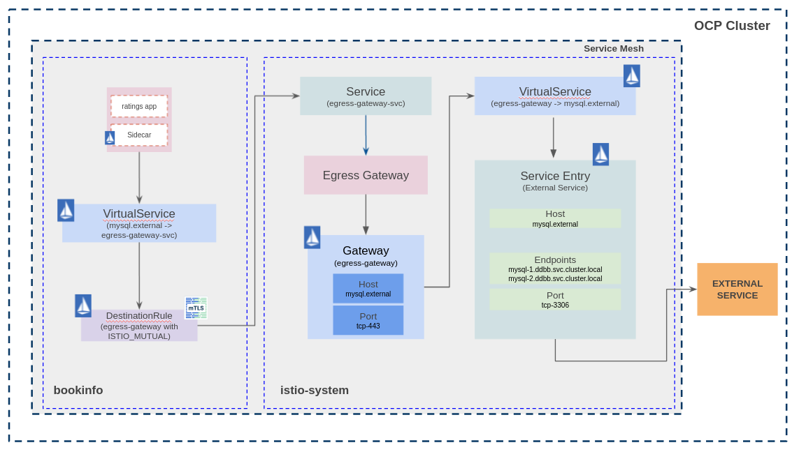

# bookinfo-mysql-multiple-ns
Service Mesh configuration for bookinfo sample application with external ratings database using an egress Gateway for routing TCP traffic - [Egress TCP blog post](https://istio.io/latest/blog/2018/egress-tcp/).

In this example, the components used are as follows:
 - [Openshift Container Platform 4.8](https://docs.openshift.com/ "Openshift's Documentation")
 - [Maistra Service Mesh 2.0.6](https://maistra.io/ "Maistra's Documentation") -- [Istio v1.6](https://istio.io/v1.6/ "Istio's Documentation")
 - [Bookinfo Sample application](https://github.com/maistra/istio/tree/maistra-2.1/samples/bookinfo "Bookinfo Sample")
 - [Mysql 8.0](https://dev.mysql.com/doc/relnotes/mysql/8.0/en/)


## Prerequisites
 - OCP up and running.
 - DNS zone (external hosted zone in this example). Thus, I can use an alias instead of the external service name. The idea is to abstract the applications from the external service's name using the **Service Entry** object.
 - Openshift Service Mesh installed [Openshift Service Mesh](https://docs.openshift.com/container-platform/4.8/service_mesh/v2x/ossm-about.html).
 - Egress configured in SMCP.


## MySQL instances
Three MySQL instances are deployed outside the Mesh in the _ddbb_ project: mysql-1, mysql-2 and mysql-3. Each mysql instance has a different rating number that will be consumed by the ratings application:
* mysql-1: Ratings point equals 1.
* mysql-2: Ratings point equals 5.
* mysql-3: Ratings point equals 3.

Create ddbb project
```
oc new-project ddbb
```

Create secret with MySQL credentials used by buildconfig
```
oc create -n ddbb secret generic mysql-credentials-1 --from-env-file=./mysql-deploy/params.env
oc create -n ddbb secret generic mysql-credentials-2 --from-env-file=./mysql-deploy/params-2.env
oc create -n ddbb secret generic mysql-credentials-3 --from-env-file=./mysql-deploy/params-3.env
```

Deploy mysql-1
```Shell
oc process -f mysql-deploy/mysql-template.yaml --param-file=mysql-deploy/params.env | oc create -n ddbb -f -
```

Deploy mysql-2
```Shell
oc process -f mysql-deploy/mysql-template.yaml --param-file=mysql-deploy/params-2.env | oc create -n ddbb -f -
```

Deploy mysql-3
```Shell
oc process -f mysql-deploy/mysql-template.yaml --param-file=mysql-deploy/params-3.env | oc create -n ddbb -f -
```

All the MySQL instances should be running in _ddbb_ project.

## Egress TCP using Service Entry. TCP routing from sidecar to egress and from egress to external service.
### Explanation
Ratings application consumes external MySQL databases ([Ratings config here](./bookinfo-app/back/bookinfo-ratings-v2-mysql_custom.yaml)). This application will connect to _mysql.external_ host, which will be resolved by the Service Entry object. Then, the Service Entry object will route the traffic to the three mysql instances.

### App diagram
The traffic flow is:
1. The sidecar intercept the request from the app container (ratings) to _mysql.external_.
2. The Virtual Service and Destination Rule objects route the request from the sidecar (bookinfo) to the egress Gateway (istio-system).
3. At this point, the Virtual Service and Service Entry objects resolve the endpoints and route the traffic through the egress Gateway.



### Assumptions
- For this use case, we are going to simulate a non cluster-admin user deploying the _bookinfo_ application.

- Grant user permissions to access the mesh by granting the *mesh-user* role (as privileged user):
```
oc policy add-role-to-user -n istio-system --role-namespace istio-system mesh-user $user
```
Now, the non cluster-admin could join the mesh using the _ServiceMeshMember_ object.

- An ingress must be deployed by the cluster-admin user in the _istio-system_ project and configured like [this one](https://github.com/fperearodriguez/rhssom-traffic-management/blob/main/ossm/istio-system/gw-default.yaml).

- The OCP routes and the Egress gateway's objects must be created by the cluster-admin.

### Deploy Custom Bookinfo application in separated Namespaces (productpage=front, reviews|ratings|details=back)
It is time to deploy the custom bookinfo application in separated namespaces. For this, a user without cluster-admin permissions will be used.

Create the front project
```
oc new-project front
```

Create the SMM to join the _front_ namespace into the mesh
```
oc apply -n front -f ossm/front/smm-front.yaml
```

Deploy custom bookinfo application
```
oc apply -n front -f bookinfo-app/front/bookinfo-front.yaml
```

Create Virtual Services, Destination Rules and OpenShift route for the front application
```
oc apply -n istio-system -f ossm/istio-system/route-bookinfo.yaml ## This must be executed as cluster-admin role
oc apply -n front -f ossm/front/vs-front.yaml
oc apply -n front -f ossm/front/dr-front.yaml
```


Create the back project:
```
oc new-project back
```

Create the SMM to join the _front_ namespace into the mesh:
```
oc apply -n back -f ossm/back/smm-back.yaml
```

Deploy reviews and details applications:
```
oc apply -n back -f bookinfo-app/back/bookinfo-back.yaml
```


Deploy ratings application with MySQL configuration:
```
oc process -f bookinfo-app/back/bookinfo-ratings-mysql.yaml --param-file=./bookinfo-app/back/params.env | oc apply -n back -f -
```

Route all the traffic destined to the _reviews_ service to its __v3__ version and route all the traffic destined to the _ratings_ service to _ratings v2-mysql_ that uses the MySQL databases previously deployed.
```
oc apply -n back -f ossm/back/vs-ratings-mysql.yaml
oc apply -n back -f ossm/back/dr-back.yaml
```

At this point, the bookinfo application is up and running and set with external database, but ratings application is not able to retrieve any data from any mysql instance.


Now, it's time to create the Istio objects to route the traffic through an egress Gateway in order to reach the _mysql_ external DDBB.

This section must be separated in two blocks:
1. Route the traffic from _ratings_ to the _tcp-egress_ egress gateway located in _istio-system_ namespace. This task must be performed by the non cluster-admin user.

Create Istio objects in the back namespace:
```
oc apply -n back -f ossm/back/mysql-egress/dr-tcp-egress.yaml
oc apply -n back -f ossm/back/mysql-egress/vs-ratings-egress-custom.yaml
oc apply -n back -f ossm/back/mysql-egress/se-mysql-custom.yaml
```

2. Route the traffic from the _tcp-egress_ egress gateway to the external service. Since this objects are created in the _istio-system_ namespace, this task must be performed by the cluster-admin user.


```
oc apply -n istio-system -f ossm/istio-system/gw-tcp-egress.yaml
oc apply -n istio-system -f ossm/istio-system/se-mysql-ddbb.yaml
oc apply -n istio-system -f ossm/istio-system/vs-mysql-ddbb.yaml
oc apply -n istio-system -f ossm/istio-system/dr-mysql-ddbb.yaml
```


## Cleanup
### MySQL Instances
Delete MySQL DeploymentConfigs
```
oc process -f mysql-deploy/mysql-template.yaml --param-file=mysql-deploy/params.env | oc delete -n ddbb -f -
oc process -f mysql-deploy/mysql-template.yaml --param-file=mysql-deploy/params-2.env | oc delete -n ddbb -f -
oc process -f mysql-deploy/mysql-template.yaml --param-file=mysql-deploy/params-3.env | oc delete -n ddbb -f -
```

Delete secrets
```
oc delete -n ddbb secret mysql-credentials-1
oc delete -n ddbb secret mysql-credentials-2
oc delete -n ddbb secret mysql-credentials-3
```

Delete OCP project
```
oc delete project ddbb
```
### Bookinfo
#### Bookinfo

Delete Istio objects
```
oc delete -n back -f ossm/back/
oc delete -n front -f ossm/front/
oc delete -n istio-system -f ossm/istio-system/
oc delete -n istio-system -f ossm/security
```

Delete ingress credential
```
oc delete secret -n istio-system ingress-credential
```

Delete OCP project
```
oc delete project back
oc delete project front
```