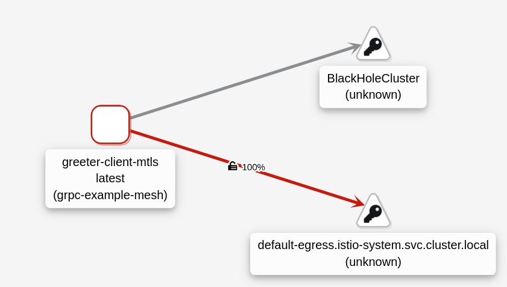

# rhossm-grpc-example
Greeter server and client examples using RHOSSM in OCP. In this example, the greeter server is deployed outside the mesh and the greeter client inside the mesh, so the client will use the egress gateway to reach the greeter server.


## Prerequisites
 - OCP 4.6 or higher.
 - Openshift Service Mesh up and running (see [RHOSSM Installation](https://github.com/fperearodriguez/rhossm-installation)).
 - OC cli installed.
 - OCP configured for supporting HTTP/2 (port-name, ingress).


## Generate certificates
In this use case, the greeter server and client will be deployed using mTLS mode. Update the file [Generate certs](./certs/generate_certs.sh) with your OCP domain and run the script:

```
./certs/generate_certs.sh
```

## Build images and push them to the registry
You can find a Dockerfile inside the _greeter-server_ and _greeter-client_ folders to build the images used in this example. Build and push the images to your registry.

Anyway, you can use the default images that are set in the deployment object.
## Case 1: Deploy the greeter server and greeter-client in a non-mesh namespace
Deploy the greeter server in OCP in a non-mesh namespace.

For this example, the certificates must be created as follows:
```
SERVER_CN=greeter-server.grpc-example.svc.cluster.local
CLIENT_CN=greeter-client.grpc-example.svc.cluster.local
```

The container image must exist in the OCP registry. Here, you can do it as you prefer. Keep in mind that you must update the deployment yaml file with the image name.

Create _grpc-example_ project
```
oc new-project grpc-example
```

Create the server certificates
```
oc create secret generic greeter-server-certs -n grpc-example --from-file=./certs/server.pem --from-file=./certs/server.key --from-file=./certs/ca.pem
```

Deploy the greeter server
```
oc apply -n grpc-example -f greeter-server/greeter-server-mtls.yaml
```

### Deploy greeter client
Deploy the greeter client in OCP.

Repeat the steps from the previous point in order to create and upload the greeter client container image.

### Greeter client in the same namespace as greeter server
You can run this step in order to test the greeter client and server, and the certificates created at the beginning.

Create the client certificates
```
oc create secret generic greeter-client-certs -n grpc-example --from-file=./certs/client.pem --from-file=./certs/client.key --from-file=./certs/ca.pem
```

Deploy the greeter client
```
oc apply -n grpc-example -f greeter-client/greeter-client-mtls.yaml
```

In the pod _greeter-client-mtls-*_, you can check that the greeter-client is authenticated an the server responses "hello":
```
Greeting: Hello you (authenticated as "greeter-client.grpc-example.svc.cluster.local" via mTLS)
Greeting: Hello you (authenticated as "greeter-client.grpc-example.svc.cluster.local" via mTLS)
Greeting: Hello you (authenticated as "greeter-client.grpc-example.svc.cluster.local" via mTLS)
Greeting: Hello you (authenticated as "greeter-client.grpc-example.svc.cluster.local" via mTLS)
Greeting: Hello you (authenticated as "greeter-client.grpc-example.svc.cluster.local" via mTLS)
```

Delete the greeter client
```
oc delete -n grpc-example -f greeter-client/greeter-client-mtls.yaml
```

Delete the client certificates
```
oc delete secret greeter-client-certs -n grpc-example
```

### Greeter client using Openshift Service Mesh
Now, the greeter client will be deployed in the Service Mesh. To connect to the greeter server via mTLS, we will use an egress gateway.

Create _grpc-example-mesh_ project
```
oc new-project grpc-example-mesh
```

Add the _grpc-example-mesh_ namespace to the Service Mesh
```
oc apply -f ossm/grpc-example-mesh/smm.yaml
```

Deploy the greeter client
```
oc apply -n grpc-example-mesh -f greeter-client/greeter-client-mtls_ossm.yaml
```

The greeter client is not able to connect to the server if you check the pod's log. It's time to create the Istio objects.

Create the client certificates, but in this case the egress gateway will use them
```
oc create secret generic greeter-client-certs -n istio-system --from-file=./certs/client.pem --from-file=./certs/client.key --from-file=./certs/ca.pem
```

Configure the egress gateway to use the certificates. The SMCP should be configured like this:
```
        volumes:
        - volume:
            secret:
              secretName: greeter-client-certs
          volumeMount:
            mountPath: /etc/istio/greeter-client-certs
            name: greeter-client-certs
```

You can check Kiali to see how the traffic flow is changing when creating the Istio objects. At this moment, the greeter-client is redirect to BlackHoleCluster.


Create the Virtual Service to route the traffic from the greeter-client app to the egress gateway K8S Service.
```
oc apply -f ossm/grpc-example-mesh/vs-greeter-server.yaml
```

Now, the greeter-client is redirect to the egress gateway K8S Service but it is not able to connect.


Apply the Destination Rule to use ISTIO_MUTUAL tls negotiation between the greeter client app and the egress gateways K8S Service.
```
oc apply -f ossm/grpc-example-mesh/dr-greeter-server.yaml
```

The greeter-client is redirect to the egress gateway K8S Service and connecting using ISTIO_MUTUAL.



Create the Virtual Service, Service Entry and Gateway in _istio-system_ namespace.
```
oc apply -f ossm/istio-system/gw-greeter-server.yaml
oc apply -f ossm/istio-system/se-greeter-server.yaml
oc apply -f ossm/istio-system/vs-greeter-server.yaml
```

At this point, the traffic is being redirected from the greeter-client app to the egress gateway, and then to the greeter-server. But, as you can see in Kiali, the greeter-client is still unable to connect.


In Kiali we can see that the GRPC code is 14 and the message "Check DestinationRule or VirtualService)


Apply the Destination Rule to use the greeter-client certificates in the egress gateway.
```
oc apply -f ossm/istio-system/dr-greeter-server.yaml
```

Finally, the greeter-client is able to connect to the greeter-server using the egress gateway.


In the pod _greeter-client-mtls-*_, you can check that the greeter-client is authenticated an the server responses "hello" again:
```
Greeting: Hello you (authenticated as "greeter-client.grpc-example.svc.cluster.local" via mTLS)
Greeting: Hello you (authenticated as "greeter-client.grpc-example.svc.cluster.local" via mTLS)
Greeting: Hello you (authenticated as "greeter-client.grpc-example.svc.cluster.local" via mTLS)
```


## Case 2: Deploy the greeter server in mesh-2 and the greeter client in mesh-1

For this case, a new greeter-client (mesh-1) and greeter-server (mesh-2) will be deployed.

To deploy another Service Mesh in the cluster, visit this [repository](https://github.com/fperearodriguez/rhossm-installation#adding-a-new-ossm-to-the-openshift-cluster).

Once the new OSSM is created in the OCP cluster, it is time to deploy the new greeter server which will be exposed over the Ingress Gateway.

Create the _grpc-server_ namespace
```
oc new-project grpc-server
```

Create the new certificates for this greeter server.

Create the server certificates in _istio-system-pre_ namespace
```
oc create secret generic greeter-server-certs -n istio-system-pre --from-file=tls.crt=./certs-pre/server.pem --from-file=tls.key=./certs-pre/server.key --from-file=ca.crt=./certs-pre/ca.pem
```

Deploy the greeter server
```
oc apply -n grpc-server -f greeter-server/greeter-server-mtls_ossm.yaml
```

Create the OCP route
```
oc apply -n istio-system-pre -f ossm/istio-system-pre/route-greeter-server.yaml
```

Create the Gateway, Virtual Service and Destination Rule
```
oc apply -n istio-system-pre -f ossm/istio-system-pre/gw-default-ingress.yaml
oc apply -n grpc-server -f ossm/grpc-server-pre/
```

### Connect a new greeter client deployed in mesh-1 to the greeter-server deployed in mesh-2
Deploy the new greeter client
```
oc apply -n grpc-example-mesh -f greeter-client/greeter-client-mtls_ossm-mesh2.yaml
```

Create the client certificates, the egress gateway will use them:
```
oc create secret generic greeter-client-certs-mesh2 -n istio-system --from-file=./certs-pre/client.pem --from-file=./certs-pre/client.key --from-file=./certs-pre/ca.pem
```

Configure the egress gateway to use the certificates. The SMCP should be configured like this:
```
        volumes:
        - volume:
            secret:
              secretName: greeter-client-certs-mesh2
          volumeMount:
            mountPath: /etc/istio/greeter-client-certs-mesh2
            name: greeter-client-certs-mesh1
```

Create the Virtual Service to route the traffic from the new greeter-client app to the egress gateway K8S Service.
```
oc apply -f ossm/grpc-example-mesh/vs-greeter-server-mesh2.yaml
```

Apply the Destination Rule to use ISTIO_MUTUAL tls negotiation between the new greeter client app and the egress gateways K8S Service.
```
oc apply -f ossm/grpc-example-mesh/dr-greeter-server-mesh2.yaml
```

The new greeter-client is redirect to the egress gateway K8S Service and connecting using ISTIO_MUTUAL.

Create the Virtual Service, Service Entry and Gateway in _istio-system_ namespace.
```
oc apply -f ossm/istio-system/gw-greeter-server.yaml
oc apply -f ossm/istio-system/se-greeter-server-mesh2.yaml
oc apply -f ossm/istio-system/vs-greeter-server-mesh2.yaml
oc apply -f ossm/istio-system/dr-greeter-server-mesh2.yaml
```